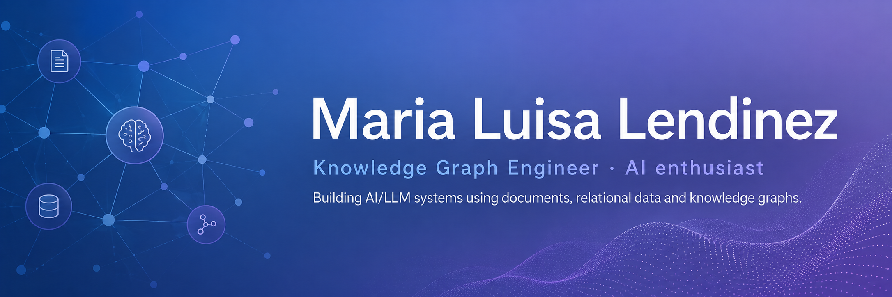

  

## What I'm working on

- RAG for document-based knowledge
- Text to SQL for relational data
- GraphRAG for knowledge graphs
- Retrieval evaluation

---

## Featured Projects

| Project | Content |
|---|---|
| [**rag-from-scratch**](https://github.com/mllendinez10/rag-from-scratch) | RAG pipeline built from scratch with chunking, BM25, embeddings, ChromaDB, hybrid retrieval, evaluation and local LLM generation |
| [**text-to-sql-from-scratch**](https://github.com/mllendinez10/text-to-sql-from-scratch) | Ask questions in natural language, generate the SQL, query the database, and return a useful answer |

---

## Technologies

Python · SQL · Knowledge Graphs · Vector Databases · RAG · GraphRAG · LLMs

